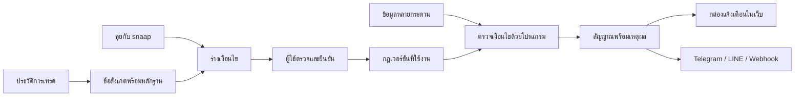

# snaap — แบบระบบฉบับพัฒนา

> เริ่มลง implementation แล้ว: ดู [สถานะจริงและงานค้าง](implementation-status.md) และ [วิธีรัน](../README.md) เอกสารด้านล่างเก็บข้อเสนอออกแบบเดิม ไม่ใช่รายการสิ่งที่ทำเสร็จ

วันที่ออกแบบ: 3 ตุลาคม 2026 · สถานะ: ข้อเสนอเพื่อใช้พัฒนาต่อ ไม่ใช่ระบบที่เชื่อมต่อจริงแล้ว

## ข้อกำหนดที่ยืนยันแล้ว

- เริ่มจาก **คุยกับ snaap** มือใหม่ไม่ต้องเริ่มจากฟอร์มอินดิเคเตอร์ คนมีสูตรปรับรายละเอียดได้
- รองรับหลายกระดานชั้นนำตั้งแต่รุ่นแรก ไม่จำกัดให้ผู้ใช้เริ่มกระดานเดียว
- ใช้ชื่อเมนูและข้อความตรงหน้าที่ ไม่มีคำโปรยหรือคำเปรียบเทียบที่ไม่ช่วยใช้งาน
- คงธีมสว่าง–มืดและสีแบรนด์ที่ปรับแล้ว
- ทำงานใน `D:\SNAAP` และ local เท่านั้น จนกว่าผู้ใช้จะขอเผยแพร่
- แจ้งเตือนตามเงื่อนไข ไม่วางคำสั่งซื้อขายอัตโนมัติ

## อ่านตามลำดับ

| เอกสาร | สิ่งที่ตัดสินใจได้จากเอกสาร |
|---|---|
| [ประสบการณ์ผู้ใช้และขอบเขต](product-spec.md) | ทุกหน้าทำอะไร ผู้ใช้เจออะไรเมื่อสำเร็จหรือผิดพลาด |
| [สถาปัตยกรรมและกติกาข้อมูล](architecture.md) | ข้อมูลเดินทางอย่างไร กฎคำนวณอย่างไร ป้องกันการส่งซ้ำอย่างไร |
| [สัญญาข้อมูลและ API](contracts.md) | โครงสร้างกฎ สถานะ และ API ที่ frontend/backend ใช้ร่วมกัน |
| [ลำดับพัฒนาและเกณฑ์รับงาน](delivery-plan.md) | งานที่เหลือ ลำดับที่ควรทำ และสิ่งที่ต้องทดสอบก่อนเปิดใช้ |
| [หลักฐานจากเอกสารและคอมมู](research.md) | จะใช้ repo ไหน เอาบทเรียนอะไรมาใช้ และอะไรยังไม่ควรเชื่อ |

มี [ตัวอย่างกฎแบบ JSON](examples/rule.json) สำหรับทีมพัฒนา และหน้าอ่านแบบระบบที่ `http://127.0.0.1:4173/system-design.html`

## ขอบเขตของงานรอบนี้

ออกแบบระบบทั้งหมดและจัดทำสัญญาข้อมูล ตัวอย่าง และลำดับพัฒนา การสร้างฐานข้อมูล การต่อกระดาน ส่งข้อความจริง และเรียก AI ยังไม่ได้ทำ ไม่ได้ติดตั้ง dependency สมัครบริการ หรือใช้ credential ของผู้ใช้

เอกสารเป็นแบบฉบับแรกสำหรับตรวจทาน ไม่ใช่การอ้างว่าทุก decision ได้รับการรับรองแล้ว ค่าความจุ ระยะเก็บข้อมูล และเป้าหมายเวลาในเอกสารเป็นค่าเริ่มต้นที่เสนอ ต้องวัดจริงก่อนรับปากกับผู้ใช้

## ภาพรวม

ข้อเสนอสำคัญ: ใช้ AI เพื่อช่วยเขียนและอธิบายกฎ แต่ไม่ใช้ AI ตัดสินทุกครั้งที่ราคาขยับ ใช้ข้อมูลตลาดร่วมกันต่อกระดาน/คู่/กรอบเวลา เพื่อไม่เปิดการเชื่อมต่อแยกตามผู้ใช้ทุกคน
