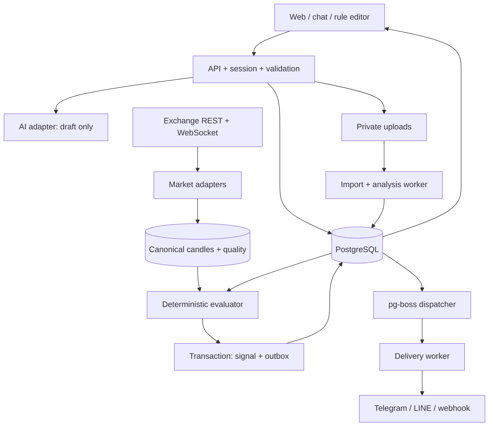

# สถาปัตยกรรมและกติกาประมวลผล

Design v1 · 2026-10-03 · เป็นแบบสำหรับสร้างต่อ ยังไม่ได้ติดตั้งหรือเปิดบริการเหล่านี้

## 1. เลือกโครงสร้างที่ดูแลได้

เสนอ TypeScript บน Node.js, PostgreSQL, pg-boss สำหรับงาน background และไฟล์แบบ private object storage abstraction เริ่มเป็น **modular monolith** ที่แยก process API/market worker/delivery worker/import worker จาก source เดียวกัน ไม่เริ่มด้วย microservices จำนวนมาก

เหตุผล: source เดิมเป็น JavaScript, กฎกับหน้าสรุปแชร์ type ได้, transaction ของฐานข้อมูลใช้ผูก signal กับ outbox ได้, ไม่ต้องเพิ่ม Redis เพียงเพื่อส่งข้อความแต่แรก pg-boss เป็นตัวเลือกคิวที่ใช้ PostgreSQL [R05](research.md) แต่ยังต้องทดสอบโหลดจริง ห้ามนำคำว่า exactly-once ของคิวไปสัญญาว่าผู้ให้บริการข้อความจะส่งครั้งเดียวแน่นอน

Frontend: รักษาหน้าตาและเส้นทางเดิม แยก state/domain ออกจาก DOM ก่อน ไม่ย้าย framework ทั้งเว็บในคราวเดียว ถ้าจะใช้ React/Vite ให้เป็นงาน migration เฉพาะที่มี snapshot และ parity test ไม่ใช่เงื่อนไขบังคับของ backend

API framework เสนอ Fastify และ JSON Schema/Ajv เป็น single contract source; pin รุ่นที่ทดสอบแล้วตอน implementation ไม่ใช้ floating latest ระบบคำนวณเป็น pure TypeScript ไม่มี network ใน evaluator

PostgreSQL ในภาพเป็น logical store เดียว; candle table/partition แยกจาก transactional tables ไม่ส่งทุก tick เข้า job queue ให้คิวรับเฉพาะงาน lifecycle, closed-candle evaluation, import และ delivery; partial-candle intrabar ใช้ bounded stream ใน worker แล้ว persist checkpoint

## 2. Local และการรันต่อเนื่อง

ปัจจุบัน `server.cjs` เสิร์ฟไฟล์อย่างเดียวที่ 127.0.0.1:4173 ไม่มี backend เฝ้าราคา เพิ่ม backend แบบ bind loopback เมื่อเริ่ม implementation และ proxy ผ่าน origin เดียวกัน

runtime ที่เสนอ: web/API + PostgreSQL + workers ใน local มี health panel บอก process และเวลาที่ข้อมูลเข้าล่าสุด การปิด tab ไม่หยุด worker แต่การปิดเครื่อง/sleep หยุดงานแน่นอน จัดการ resume/backfill เสมอ

Telegram local ใช้ long polling ได้ จึงไม่ต้องเปิด tunnel เพื่อรับคำสั่งบอต LINE webhook และ inbound webhook จากภายนอกต้อง public HTTPS; ใน local ทดสอบได้ด้วย fixture และ outbound message เท่านั้นจนกว่าจะมี runtime สาธารณะที่ผู้ใช้อนุญาต ห้ามเปิด tunnel/เผยแพร่ให้เอง

การย้ายไปรัน 24/7 ในอนาคตเป็นการตัดสินใจแยก ไม่เสนอว่า static hosting ปัจจุบันจะรัน market worker ยาว ๆ ได้โดยอัตโนมัติ

## 3. Exchange adapter และ capability registry

อินเทอร์เฟซแต่ละ adapter มี `listInstruments`, `fetchCandles`, `subscribeCandles`, `health`, และ optional `fetchPrivateFills`/`fetchFunding`/`inspectCredentialPermissions` ไม่เปิด method ส่ง order ให้ application layer

| กระดาน | ข้อมูลที่เอกสารยืนยัน | สิ่งที่ต้องพิสูจน์ก่อนเปิดจริง |
|---|---|---|
| Binance | Spot streams มีข้อจำกัด connection lifetime และ stream count [R01] | rotate connection, final kline flag, REST overlap, futures adapter แยก, region |
| Bybit | kline `confirm=true` หมายถึงปิดแท่ง; endpoint แยก spot/linear [R02] | convert interval, volume unit, heartbeat, spot/linear contract fixtures |
| OKX | `confirm=1` และหน่วย vol ต่างระหว่าง spot/contracts [R03] | instrument contract metadata, candle timezone, business/public channel |
| Bitget | candle channel เป็น snapshot/update มีหน่วย base/quote [R04] | finalization policy ผ่าน next bucket + REST confirmation, UTC daily alignment |
| MEXC | มี Spot/Futures docs และ migration Spot WebSocket ไป Protobuf [R08] | schema decode, current endpoint, limits, finalization, capability ของ private history |

CCXT [R06] ช่วย catalogue/REST backfill และ private history ได้หลังทดสอบแต่ละ method ส่วน path realtime ใช้ native adapter เมื่อ unified wrapper ไม่ให้ finality, sequence หรือหน่วยครบ อย่าผสม native กับ CCXT แล้วนับข้อมูลซ้ำ

Registry เก็บ `exchange`, `marketType`, `region`, `timeframes`, `priceSources`, `volumeUnits`, `hasFinalFlag`, `historyCapabilities`, `supported/maintenance/unverified`, `verifiedAt`, `adapterVersion` แต่ละ capability มี smoke-test result ไม่ใช้โลโก้กระดานเป็นหลักฐานว่ารองรับทุกอย่าง

Release v1 ตั้งเป้าชุด 5 กระดานด้านบนและต้องเลือกใช้งานหลายกระดานพร้อมกันได้ ระหว่างพัฒนาทดสอบเป็นชุดย่อยได้ แต่ไม่ถือว่าเสร็จครบขอบเขต ตลาดที่ไม่ผ่านต้องติดป้ายยังไม่พร้อมและบันทึก blocker ชัด การลดจากชุดที่ออกแบบต้องรายงาน ไม่ส่งงานโดยบอกว่าครบทั้งหมด

## 4. Canonical market data

Instrument identity = exchange + marketType + exchangeSymbol + settlement + contractVariant อย่าใช้แค่ BTCUSDT เพราะ Spot/perpetual/expiry ไม่ใช่สินทรัพย์เดียวกัน

Candle identity = instrumentId + timeframe + sessionBasis + priceSource + openTimeUTC; unique constraint ป้องกันซ้ำ `closeTime` เป็น exclusive end ใน domain model adapters แปลง provider end-inclusive ให้ตรงกัน

ราคา/ปริมาณ/P&L เก็บ decimal string หรือ NUMERIC ไม่ใช้ binary float สำหรับเงิน/ค่าธรรมเนียม การคำนวณ indicator ใช้ Float64 แบบกำหนด seed, precision และ implementation version คงที่ ไม่ round ก่อนเทียบ threshold; round เฉพาะแสดงผล

ทุก candle เก็บ `isFinal`, `providerEventAt`, `receivedAt`, `sourceRevision`, `quality`, `volumeUnit` และ checksum เก็บ partial แบบ upsert ไม่ append ทุก tick เป็นแท่งใหม่ ไม่แก้ historical final candle โดยไม่มี revision/audit

### การรับข้อมูล

1. โหลด catalogue และ checkpoint
2. เติมแท่งย้อนหลังให้ warmup พร้อม
3. subscribe WS ที่แชร์ตาม instrument/timeframe ใช้ reference count รวมผู้ใช้
4. normalize, validate OHLC, timestamp, finite numeric, volume nonnegative
5. reconcile REST/WS overlap และ out-of-order แบบ monotonic revision
6. ประเมินเฉพาะข้อมูลที่ผ่าน quality gate

ถ้า provider ไม่มี final flag ไม่สรุปแท่งปิดเพราะนาฬิกา client ผ่านเวลาอย่างเดียว ต้องใช้ server time + grace period + next bucket หรือ REST ยืนยันตาม contract ของ adapter

ขาดแท่งเพราะไม่มีการซื้อขายกับขาดเพราะ network เป็นคนละกรณี เก็บสถานะแยก ไม่เติม OHLC เทียมแล้วทำเหมือนเป็นข้อมูลจากกระดาน ค่าเริ่มต้นหยุดการประเมิน window ที่ขาด จน adapter มี policy no-trade ที่ตรวจรับรองแล้ว [R06]

### Health และการกู้คืน

วัด connection heartbeat, subscription ACK, provider lag, last event และ last final candle แยกกัน กระดานที่ส่งเฉพาะตอนมี trade ห้ามใช้ “ไม่มีราคาใหม่ 10 วินาที” เป็น offline โดยลำพัง

ถ้า gap: ต่อใหม่ด้วย exponential backoff+jitter → backfill ตั้งแต่ last final checkpoint พร้อม overlap → ตรวจเรียงข้อมูล → warmup → resume หาก stale ไม่ประเมินบนค่าค้าง ระหว่าง recovery แสดงย้อนหลังใน inbox แบบ `RECOVERED` และค่าเริ่มต้นไม่ push สัญญาณเก่ารัว ๆ

ข้อมูลแก้ย้อนหลังต้องเก็บ correction event และคำนวณผลใหม่สำหรับการตรวจสอบ ไม่ลบ evidence ที่ส่งไปแล้ว ไม่สร้าง push สดจากผลใหม่โดยอัตโนมัติ

## 5. Rule engine ที่ตรวจซ้ำได้

กฎเป็น AST ตาม [contracts](contracts.md) ไม่ใช้ `eval()` หรือรันโค้ดที่ LLM สร้าง UI editor, chat, live evaluator และ historical replay ต้องใช้กฎเวอร์ชันเดียวกัน

แยก **trigger** เช่น RSI crosses above 30 ออกจาก **filter** เช่น price > EMA200; crosses เกิดเมื่อ `previous <= threshold && current > threshold` ไม่ใช่แค่อยู่เหนือ threshold ภายหลัง

กลุ่ม AND/OR ใช้ตรรกะ 3 ค่า TRUE/FALSE/UNKNOWN; หากผลสุดท้าย UNKNOWN ไม่สร้าง signal และบอกข้อที่ประเมินไม่ได้ ใช้ truth table ที่ทดสอบแล้ว เช่น TRUE OR UNKNOWN เป็น TRUE, FALSE AND UNKNOWN เป็น FALSE; metadata ต้องยังรายงานข้อมูลขาดแม้ผลเชิงตรรกะตัดสินได้

MVP: ชุดกฎมี trigger หนึ่งชุดและ filters แบบ groups จำกัดความลึก 3, ไม่เกิน 20 leaves ต่อกฎ; ตัวเลขเป็น capacity guard ที่เสนอ อธิบายได้เมื่อเกิน limit ไม่ตัดกฎเงียบ ๆ

Indicator semantics v1:

- EMA(n): seed ด้วย SMA ของ n ค่าแรก alpha=2/(n+1); เก็บ engineVersion เพราะ seed ต่างทำให้ผลต่าง
- RSI(n): Wilder smoothing; initial gain/loss จาก n price changes; loss=0 และ gain>0 →100, gain=loss=0 →50 เป็น convention ของ snaap ที่ต้องระบุและทดสอบ
- SMA(n): n แท่งสมบูรณ์ตามหน้าต่างที่ระบุ
- Volume ratio: `volume[current] / mean(volume[previous n closed candles])`; denominator=0 → UNKNOWN; ไม่เอา current เข้า baseline
- Intrabar volume ใช้ current cumulative เทียบ full closed baseline และต้องอธิบาย ไม่แอบ extrapolate ตามเวลาที่ผ่าน
- Warmup: ไม่ใช่มีครบ period แล้วรับประกันพอ; seed อย่างน้อย max(5×period, period+1) เป็น initial policy แล้วทำ convergence tests เทียบ window ยาวกว่า ปรับตาม indicator; ถ้าไม่ผ่าน tolerance ไม่ certify [R07]

Cross timeframe (ระยะถัดไป): evaluation timestamp t ใช้เฉพาะ higher-timeframe bar ที่ `closeTime <= t`; ไม่ใช้ค่า final ของแท่งที่ยังไม่จบที่เวลานั้น ทุก node ระบุ source/timeframe และ anchor trigger ชัด

### Trigger, cooldown และ dedup

Closed-candle default `ON_ENTER`: ส่งเมื่อทั้ง trigger/filter เข้าเงื่อนไขใหม่ และไม่มากกว่า 1 ครั้งต่อ rule revision + instrument + candle + trigger key; กฎแบบเงื่อนไขคงค้าง rearm หลังเคย FALSE อีกครั้ง กฎ crosses ต้องเกิด cross ใหม่

เปิดกฎ/เริ่มใหม่หลัง pause ค่าเริ่มต้น prime state แล้วรอ transition ใหม่ หากเลือก initial snapshot ต้องตั้ง flag และแยก kind=INITIAL_SNAPSHOT

Intrabar เป็น opt-in ระยะถัดไป: ประเมิน bounded cadence, latch ไม่เกินหนึ่งครั้งต่อแท่ง, สามารถยกเลิกผลก่อนแท่งปิดได้ ต้องติดป้าย provisional และเก็บ final outcome ไม่ส่งข้อความย้อนลบสัญญาณเก่าโดยทำให้ผู้ใช้เข้าใจว่าไม่เคยเกิด

Cooldown ใช้ scope rule revision + instrument + trigger direction ไม่ใช้ global ต่อ symbol จนสัญญาณคนละทิศหาย; suppressed event เก็บ reason/count เพื่ออธิบายได้ ตัวอย่างปัญหาคอมมูดู [R16](research.md)

การแก้กฎ: draft validation → user confirms revision/hash → atomic pointer switch ณ activation boundary; ใหม่ใช้ checkpoint ของตัวเอง ไม่เปลี่ยนเงื่อนไขของ signal เก่า

## 6. Signal และการส่งข้อความ

Transaction ของ evaluator: ตรวจ running revision/control epoch → insert signal ด้วย unique dedup key → insert outbox → commit จากนั้น dispatcher จึงหยิบงาน ไม่เรียก Telegram ระหว่าง transaction

ขอบเขต pause race: เมื่อ API ตอบว่าหยุดแล้ว evaluator ใหม่ต้องเห็น control epoch ใหม่ outbox ที่ยังไม่ claim ถูก cancel; sender recheck epoch ก่อนส่ง ถ้าส่ง request ออกแล้วอาจหยุดไม่ทัน ต้องแสดงข้อจำกัดนี้ตรง delivery log

Signal evidence เป็น immutable snapshot: candle refs+revisions, raw numeric features, comparator values, ruleRevision, engineVersion, universeRevision, quality, timestamps ไม่มีการถาม LLM ให้ประดิษฐ์เหตุผลหลังเหตุการณ์

Delivery key = signalId + destinationId + templateVersion; unique index และ worker lease ลด duplicates เก็บ attempts แยก อย่าถือว่าคิวประมวลผลครั้งเดียวเท่ากับ provider side effect ครั้งเดียว

Retry เฉพาะ transient, rate limits และสถานะที่ provider ระบุ; honor Retry-After; bounded exponential backoff+jitter; failed/dead-letter เห็นได้และ redrive ใช้ key เดิม กำหนด max age ต่อชนิด alert ก่อนเริ่ม retry รอบใหม่

- Telegram: HTTP success+message_id → ACCEPTED, timeout หลัง write → UNKNOWN; ไม่มีการรับประกัน user read แสดง retry policy ที่อาจซ้ำและให้ตั้งได้ [R10]
- LINE: key เดิมสำหรับทุก attempt ผ่าน `X-Line-Retry-Key`, handle 409 ตาม semantics ของ provider ไม่สร้าง key ใหม่ทุกครั้ง; acceptance ไม่รับประกัน delivery [R09]
- Webhook: HMAC SHA-256 ของ timestamp + raw body, event ID คงที่, consumer ควร dedup และตรวจ timestamp window; ไม่ retry 4xx ถาวรยกเว้น 408/429 ตาม policy
- Inbox commit ก่อน push เสมอ ตรวจระบบภายหลังได้เมื่อ provider ล่ม

## 7. ประวัติและการวิเคราะห์

raw upload → validate/sniff → staging rows → column/timezone review → normalized fills → fee/funding reconciliation → position grouping → market enrichment ณ entry → statistics → observations → rule draft

Idempotency: file hash อย่างเดียวไม่พอ ใช้ account+exchangeTradeId ถ้ามี; ถ้าไม่มีใช้ canonical row fingerprint+occurrence index และ review ambiguity ไม่เอา fill ที่เหมือนกันทุกช่องแต่เกิดจริงสองครั้งทิ้ง เฉพาะ API/file ที่ overlap กันต้อง reconcile provenance

History completeness เก็บ coverage interval, pagination cursor, oldestAvailableAt, missing fees/funding, parserVersion; restart job ได้ ไม่อ้าง API ให้ย้อนหลังครบตลอดไป

Position grouping แยก account, instrument, hedge side; partial close allocate fee/funding ตาม policy ที่ระบุ; opening position ก่อน window → UNKNOWN cost basis, ไม่นับเป็น confirmed P&L โดยเติมราคาเอง

วิเคราะห์จากทั้ง outcomes, normalize exposure และช่วงตลาด; แบ่ง train/holdout ตามเวลาและกัน trades ที่ overlap leakage; รายงานจำนวน hypotheses ที่ลอง, sample size, uncertainty และ missing-data exclusion ห้ามเลือก winning trades แล้วเรียกว่ามี edge

ใช้ TA-Lib เป็น numerical reference/fixture และ Freqtrade lookahead/recursive methodology เป็น reference แยกงานวิจัย [R07,R11] ไม่มีการนำโค้ด GPL มารวมผลิตภัณฑ์รอบนี้

## 8. AI และความจำ

LLM tools ที่อนุญาต: อ่าน catalogue, อ่านกฎผู้ใช้, สร้าง draft, อธิบาย evidence, ขอสรุปสถิติที่ผ่าน privacy filter; ไม่มี token, filesystem หรือ arbitrary URL tools ใน product chatbot

Structured output ช่วยรูปแบบ JSON แต่ไม่รับรองความหมาย [R12] จึงมี schema validation + semantic validation + capability check + human-readable preview/hash การตอบไม่สำเร็จหรือ refusal ให้ fallback manual ไม่ซ่อน error ด้วยสูตรสำเร็จรูป

Memory มี provenance/sourceMessageId/userConfirmedAt แยก explicit preference กับ inferred observation ไม่ให้คำตอบโมเดลรอบก่อนกลายเป็นข้อเท็จจริงของผู้ใช้โดยอัตโนมัติ

เรียก AI เฉพาะการคุย/สรุป ไม่ต่อ tick; budget per conversation/user, bounded context, cache เฉพาะข้อมูลไม่เป็นความลับ ไม่ส่ง raw trades ทั้งบัญชีเมื่อ summary เพียงพอ จำกัดจำนวน retry/cost และเก็บ model+prompt version สำหรับ debug แบบ redact

## 9. Security, ownership และข้อมูลส่วนตัว

- Hosted identity ในอนาคตใช้ OIDC หรือ managed auth; opaque server session + HttpOnly/Secure/SameSite cookie, CSRF/origin check, auth rate limits, revoke sessions; ไม่สร้าง password scheme เอง
- Local instance แรกมี single workspace แต่ทุก record มี owner/workspaceId; local backend ตรวจ Origin/Host/CSRF เช่นกัน ไม่ถือ loopback = ปลอดภัยจากเว็บอื่นเสมอ
- Tenant scoping ใน service และ database policy/row ownership test; IDs เดาไม่ได้ไม่ใช่ authorization
- Private keys เข้ารหัส envelope encryption key อยู่นอก DB (OS secret store ใน local, KMS เมื่อ hosted), masked display, rotate/revoke, ไม่ลง log/browser storage/LLM
- ถ้าตรวจ permission ไม่ได้ให้บอก unverified และขอ credential แบบ read-only ไม่ลองส่ง order เพื่อทดสอบ; ไม่รับ trade/withdraw scope เมื่อ provider ตรวจได้
- Upload จำกัดขนาด 20MB/100k rows เป็นค่าเริ่มต้นเสนอ; reject macro/formula execution, ZIP bomb, malformed workbook; แยก worker และจำกัด CPU/memory; CSV export ป้องกัน formula injection
- Webhook HTTPS only, deny loopback/private/link-local/metadata IP ทั้ง IPv4/IPv6, ตรวจ DNS ทุก resolve/connect, ไม่ตาม redirect, จำกัด port/body/time; exception localhost เป็น test-only fixture ไม่ใช่ user destination
- Verify Telegram secret header/LINE signature จาก raw body ตาม mode; dedup inbound event ID; nonce one-time bound workspace+session expiry 10 นาทีเป็น policy ที่เสนอ
- Logs ไม่เก็บ secret, raw uploads หรือ account balances; trace ด้วย opaque IDs; admin access audit และ least privilege
- เสนอ retention: raw upload 30 วันหลัง import, detailed market raw samples 7 วัน, delivery attempts 90 วัน, rules/signals/history 1 ปีหรือ export; ผู้ใช้ปรับ/ลบได้ หลังตัดสินใจ storage/cost ต้องยืนยัน policy ก่อนเปิดใช้จริง
- ลบข้อมูล active ภายในงาน deletion ที่ retry ได้, tombstone กัน sync ดึงกลับ, ล้าง derived observations, backup aging เสนอไม่เกิน 30 วัน; หน้า UI ต้องแยก active deletion กับ backup expiry
- นโยบาย provider AI ขึ้นกับ endpoint/configuration ไม่รับปากว่า `store:false` = ไม่เก็บข้อมูลทุกประเภท [R13]

## 10. Capacity และ observability

เป้าทดสอบเริ่มต้น: 100 ผู้ใช้, 20 กฎต่อผู้ใช้, shared 500 instrument streams ใน 5 กระดาน, 4 timeframe views = สูงสุด 2,000 series; aggregate timeframe ได้เฉพาะ adapter ที่ยืนยัน UTC/session/volume semantics ตรงกัน จำนวน evaluation เป็น fan-out ของกฎ ไม่ใช่จำนวน socket ต่อผู้ใช้

ไม่รับประกัน latency เท่ากันทุก provider: วัด `marketCloseAt → providerEventAt → receivedAt → evaluatedAt → queuedAt → acceptedAt` แยก bottleneck เป้าภายในเสนอ p95 จาก validated final event ถึง signal commit <2s และถึง provider request <5s เมื่อไม่ติด rate limit; ไม่รวมเวลา provider ปิดแท่ง/มือถือ ไม่ใช่ SLA ที่ผ่านแล้ว

Metrics: stale series %, WS reconnects, backfill backlog, evaluation lag, duplicate conflicts, suppressed events, outbox age, delivery accepted/unknown/failed, import rejects, AI clarification/schema failures, cost per user/generation

Release gate: soak test อย่างน้อย 48 ชั่วโมงให้ครอบคลุม reconnect cycle, replay crash/duplicate fixtures, database backup-restore, queue backlog recovery; หาก capacity ไม่ผ่านให้จำกัดขอบเขตพร้อมข้อความที่ UI แทนการปล่อย silently degraded
