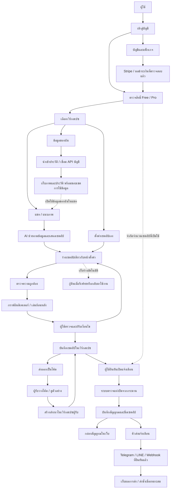
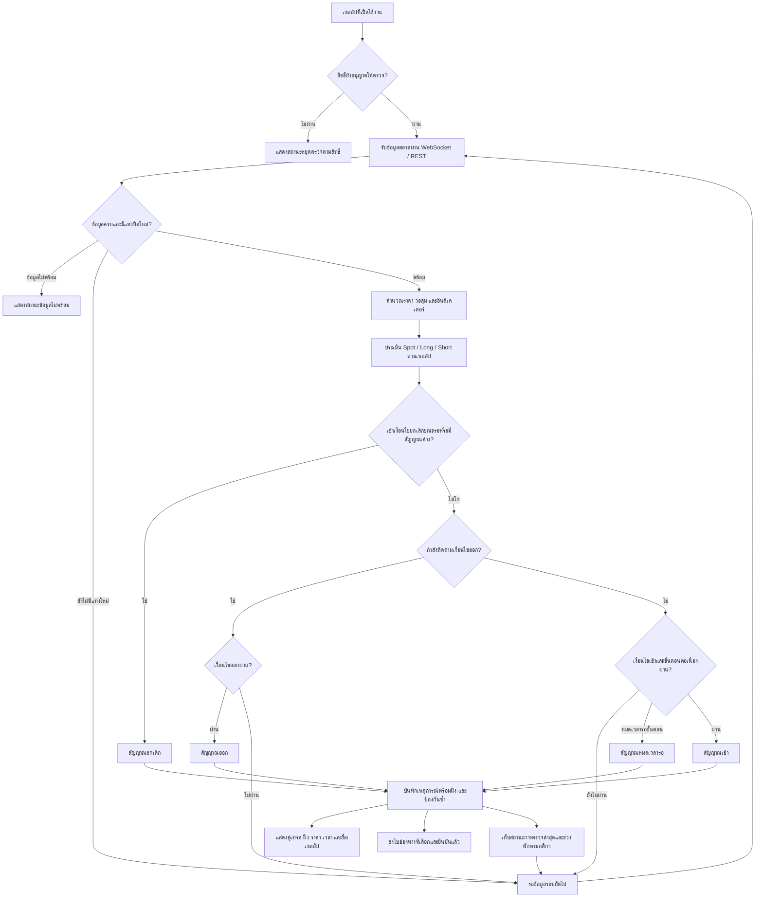
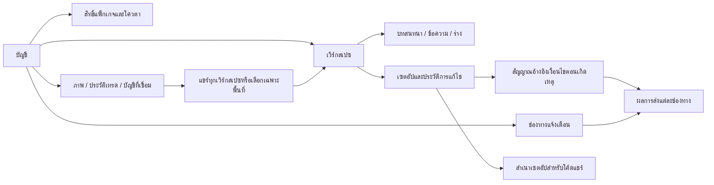

# Flow การทำงานของ Snaap

อ้างอิงโค้ดปัจจุบัน ณ 4 ตุลาคม 2026 แบ่งเป็นภาพรวมระบบและวงจรตรวจสัญญาณ

## 1. ภาพรวมระบบ

- เวิร์กสเปซกำหนดชุดบทสนทนา เซตอัป และสัญญาณที่ผู้ใช้กำลังดู ส่วนภาพและประวัติมีขอบเขตการแชร์ข้อมูล
- AI เสนอและแก้ร่างได้ แต่ผู้ใช้เป็นผู้ยืนยันเปิดแจ้งเตือน ตั้งค่าเองได้แม้ AI ยังไม่พร้อม
- สำเนาจากโค้ดนำเข้ายังไม่เปิดแจ้งเตือน และไม่ผูกช่องทางแจ้งเตือนของเจ้าของเดิม
- การบันทึกร่างใช้ทั้งข้อมูลในเบราว์เซอร์และการบันทึกร่างที่ถูกต้องบนเซิร์ฟเวอร์ ข้อมูล API key ไม่ถูกเก็บในร่างของเบราว์เซอร์
- Free สร้างเวิร์กสเปซเพิ่มไม่ได้ สิทธิ์แพ็กเกจผูกกับบัญชี การลบเวิร์กสเปซที่สร้างเพิ่มย้ายบทสนทนา เซตอัป และขอบเขตข้อมูลไปพื้นที่หลัก

## 2. วงจรตรวจและสร้างสัญญาณ

ถ้าเลือกทั้ง Long และ Short ระบบประเมินแยกกันและสร้างสัญญาณแยกฝั่ง เงื่อนไข Short ใช้แบบสลับจาก Long หรือกำหนดเองตามที่เลือกไว้ เงื่อนไขขั้นตอนต่อเนื่อง การออก ยกเลิก และช่วงพักเป็นตัวเลือกตามเซตอัป

## 3. ข้อมูลที่เก็บและความสัมพันธ์

ฐานข้อมูลหลักใช้ PostgreSQL และคิวงานใช้ pg-boss ภาพส่วนตัวเก็บผ่านระบบไฟล์ของแอป ส่วนข้อมูลกู้คืนร่างบางส่วนอยู่ในเบราว์เซอร์

ขอบเขตปัจจุบัน: ระบบสร้างสัญญาณแจ้งเตือน ไม่ส่งคำสั่งซื้อขายจริง การรัน Pine Script ใด ๆ และรับสัญญาณจาก TradingView เข้ามาโดยตรงยังไม่ใช่ความสามารถของ flow นี้ สูตร CUSTOM ที่นำเข้าได้เป็น JSON ตามรูปแบบที่ Snaap รองรับ บริการ AI ชำระเงิน และช่องทางภายนอกต้องตั้งค่าก่อนใช้จริง

แหล่งอ้างอิงในโค้ด: `src/api.ts`, `src/workspaces.ts`, `src/ai/harness.ts`, `src/context.ts`, `src/domain/engine.ts`, `src/domain/preview.ts`, `src/markets.ts`, `src/realtime.ts`, `src/monitor.ts`, `src/destinations.ts`, `src/setup-shares.ts`, `src/history.ts`, `src/billing.ts`, `dist/workbench.js`.
